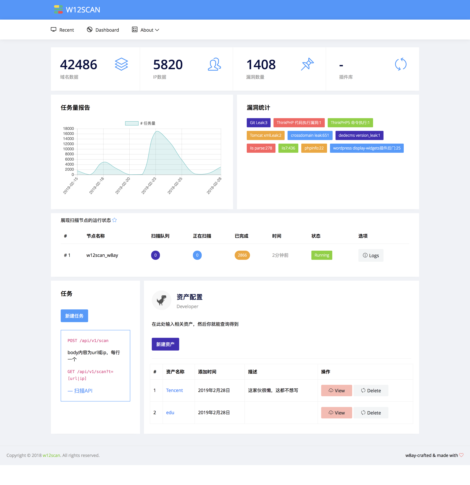
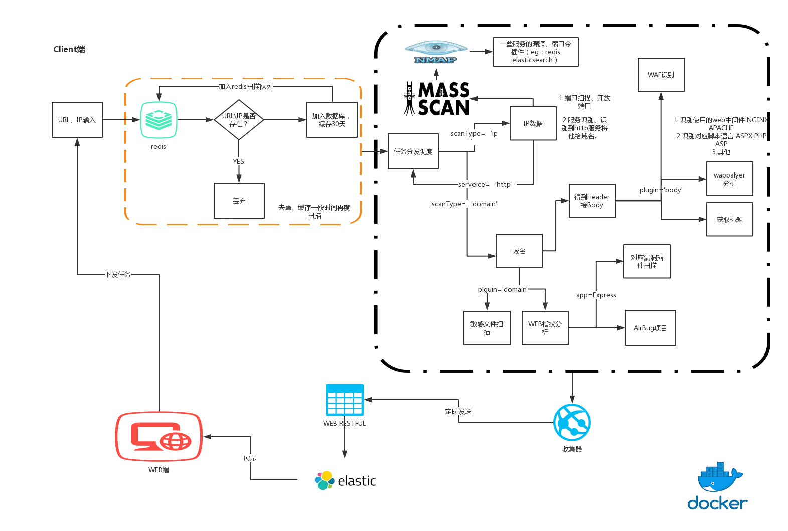

# w12scan
w12scan是一款网络资产发现引擎，通过WEB接口下发任务，w12scan会自动将相关的资产聚合在一起方便分析使用。w12scan也是我的毕业设计。

w12scan分为WEB端（用于展示显示数据）和Client端（用于搜索相关资产数据）。

这里是web端的开源程序，client端在[https://github.com/boy-hack/w12scan-client](https://github.com/boy-hack/w12scan-client)

一个视频了解W12SCAN
[](https://x.hacking8.com/content/uploadfile/201903/uper_video_1556034118929372.mp4)


## 设计思想
基于python3 + django + elasticsearch + redis(去重+web与client通信中间件)，使用WEB API添加扫描目标，扫描完成后会在WEB端展示。



## 特点

### WEB端
* 强大的搜索语法
    * 通过搜索语法可搜索cms，服务名称，标题，国家地区等等，能够迅速找到相关目标。
        - title=“abc” # 从标题中搜索
        - header=“abc” # 从http头搜索
        - body=“123” # 从body搜索
        - url = “*.baidu.com” # 搜索baidu.com的子域名，`*号是通配符`
        - ip = ‘1.1.1.1’ # 搜索IP，支持CIDR`'192.168.1.0/24'`和通配符搜索`'192.168.1.*'`
        - port = ‘80’ # 搜索端口
        - app = ’nginx’ # 搜索组件
        - country = ‘cn’ # 搜索国家
        - service = ‘mysql’ # 搜索服务
        - bug = 'xx' # 搜索存在的某个漏洞
* 自定义资产配置
    * 通过自定义某公司相关域名或ip资产，w12scan会自动帮你找到对应的资产目标，当你浏览该目标时，有醒目的标识提醒你该目标的归属。
* 自动关联
    * 进入目标详情，若目标为ip，则会自动关联该ip上的所有域名和该c段上的所有域名。若目标为域名，则自动关联旁站，c段和子域名。
* 多节点管理
    * WEB端会每隔几分钟检测一次节点的运行状况，你可以看到节点扫描的数量以及节点扫描日志。
* 任务restful
    * 提供添加任务的接口，你可以在WEB端添加或者在任何软件中集成该接口。

### 扫描端(Client)端
* 及时的poc验证
    * 通过对接[airbug](https://github.com/boy-hack/airbug)接口api，在线调用最新的poc验证脚本，airbug保证了漏洞更新的及时性，你也可以fork airbug项目后自行添加poc规则。
* 验证性攻击
    * 扫描端内置有常见的漏洞验证服务，每扫描一次网址，都会运行这些服务，结果最终会反馈到w12scan的WEB端展现。
* 扫描与识别
    * 端口扫描使用masscan，端口识别使用nmap，web应用识别调用wappalyzer和精简版的w11scan（指纹识别）
* 容易的分布式
    * 在程序架构设计就考虑到了这一点，扫描端只接受任务，最后的结果只和WEB端进行交互，所以在分布式上十分容易，直接在另一台机器上运行扫描端即可。能基于docker进行分布式，也能很方便集成celery服务。

## 安装
基于docker一键部署
```bash
git clone https://github.com/boy-hack/w12scan
cd w12scan
docker-compose up -d
```
等待一段时间后访问`http://127.0.0.1:8000`
默认用户名密码`boyhack:boyhack`

## 交流社区
Telegram交流群组:https://t.me/joinchat/MZ16xA9dfmJCYm4kbv15nA

### 相关问题
1. 根据服务器配置修改`docker-compose.yml`参数，设置elasticsearch内存占用大小，默认设置是521M，如果你是1G内存可以设置为128M。
2. 在Windows上安装，需要注意`.sh`文件格式问题 https://github.com/boy-hack/w12scan/issues/12 (感谢 @Hotsunrize).  
3. Q:如何分布式部署？A:[部署方案](./doc/DEPLOYMENT1.md)
4. Q:启动后搜索数为0？A:需要添加扫描目标
5. 不要边扫描边搜索，elastisearch在插入数据时会作分析，分词等等操作（此时效率不高），如果在此时搜索可能会返回503，建议扫描完毕后在进行搜索。(后期会使用数据迁移解决)

### 相关链接
- [设计论文](./doc/网络资产发现引擎的设计.docx)
- [如何构建一个网络空间搜索引擎-W12Scan-WEB篇](https://x.hacking8.com/post-340.html)
- [如何在本机搭建W12Scan](https://x.hacking8.com/post-342.html)

## 法律
本程序主要用于收集网络数据用于分析研究。在使用该程序之前请遵守当地相关法律进行。